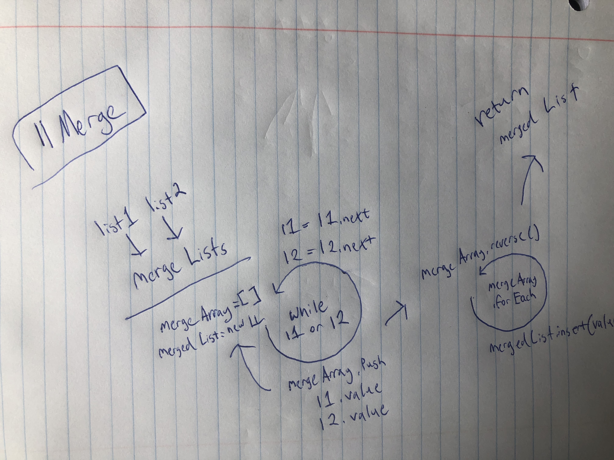
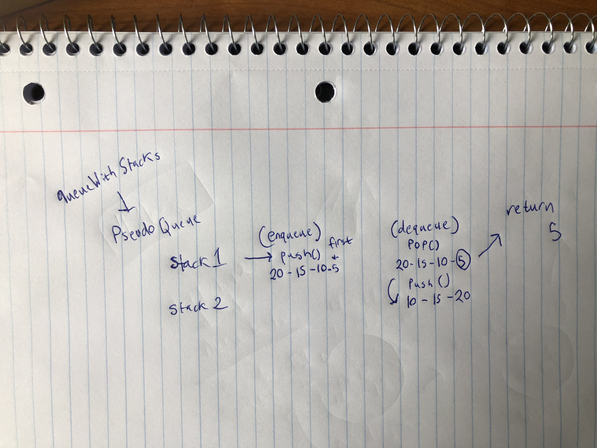

# data-structures-and-algorithms
## Table of Contents
1) arrayMap 
2) arrayShift 
3) arrayBinarySearch 
4) linkedList - DataStructure
5) llMerge 
6) stacksAndQueues - DataStructure
7) queueWithStacks 